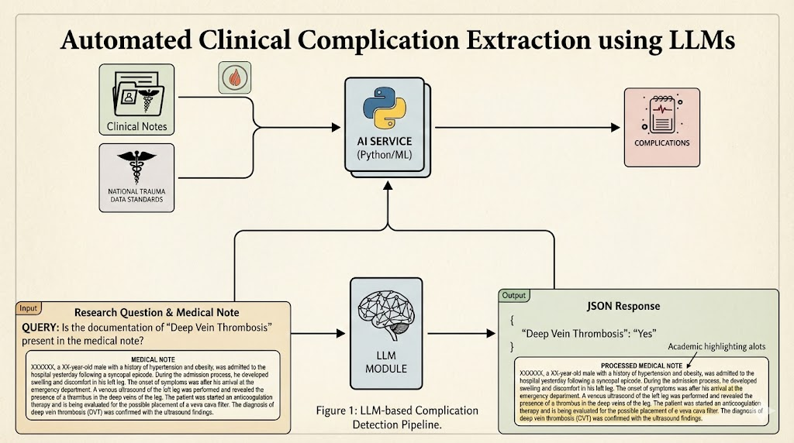

# TQIP-TRAUMA-NOTE-Extraction

LLMs offer a potential solution to streamline this process. We hypothesized that a LLM could be applied to review patient charts and identify complications as defined by the Trauma Quality Improvement Program, offering an effective adjunct to manual chart reviews. This is to a complication screening pipeline driven by LLMs that can support clinical staff to construct TQIP Trauma Note Complication Reports.

Website Link: https://kaijiezhang0831.github.io/TQIP-Trauma-Note-LLM-Extraction/
## Data
Because real clinical data, especially trauma notes and medication orders, are protected and sensitive, all of our data, the patient features, were stored in monitored and protected environment. The Prompt with CoT were created based on the [National Trauma Data Standard Data Dictionary 2025 Admission](https://health.wyo.gov/wp-content/uploads/2025/01/2025-Data-Dictionary.pdf) as the instruction.

The LLM we used is "us.deepseek.r1-v1:0" and the embedding we used is "amazon.titan-embed-text-v2:0" via Amazon Bedrock.

### patient_features
`patient_features.json` is required for the experinment, where Notes were retrieved using FHIR R4. A sample format is below. Make sure your format align for successful testing:
<pre>
  <code>
[
  {
    "csn": "CSN_000001",
    "patient_id": "P_000001",
    "admit_datetime": "2026-02-01T10:15:00",
    "discharge_datetime": "2026-02-07T14:30:00",

    "binary": [
      {
        "note_id": "N1",
        "note_type": "ED_PROVIDER_NOTE",
        "timestamp": "2026-02-01T10:30:00",
        "note": "ED TRAUMA H&P: ... full text ..."
      },
      {
        "note_id": "N2",
        "note_type": "ICU_PROGRESS_NOTE",
        "timestamp": "2026-02-02T08:00:00",
        "note": "ICU DAY 1 PROGRESS NOTE: ... full text ..."
      },
      {
        "note_id": "N3",
        "note_type": "DISCHARGE_SUMMARY",
        "timestamp": "2026-02-07T13:00:00",
        "note": "DISCHARGE SUMMARY: ... full text ..."
      }
    ],

    "medication_orders": [
      {
        "order_id": "M1",
        "timestamp": "2026-02-02T09:10:00",
        "dosage_text": "Heparin 5000 units SQ q8h"
      },
      {
        "order_id": "M2",
        "timestamp": "2026-02-03T12:20:00",
        "dosage_text": "Cefepime 2 g IV q8h"
      }
    ],

    "labels": {
      "aki": 0,
      "aws": 1,
      "ards": 0,
      "cardiac_arrest_cpr": 0,
      "cauti": 0,
      "delirium": 1,
      "dvt": 0,
      "mi": 0,
      "osteomyelitis": 0,
      "pressure_ulcer": 0,
      "pe": 0,
      "severe_sepsis": 0,
      "stroke_cva": 0,
      "superficial_ssi": 0,
      "unplanned_icu_admission": 0,
      "unplanned_intubation": 0,
      "unplanned_or_visit": 0,
      "vap": 0
    }
  }
]
    </code>
</pre>

### ground_truth.csv
`ground_truth.csv` is required for the experinment. This is constructed by professional clinical staff. A sample format is below. Make sure your format align for successful testing:
<pre>
  <code>
csn,aki,aws,ards,cardiac_arrest_cpr,cauti,delirium,dvt,mi,osteomyelitis,pressure_ulcer,pe,severe_sepsis,stroke_cva,superficial_ssi,unplanned_icu_admission,unplanned_intubation,unplanned_or_visit,vap
CSN_000001,0,1,0,0,0,1,0,0,0,0,0,0,0,0,0,0,0,0
CSN_000002,0,0,1,0,0,0,1,0,0,0,0,0,0,0,0,1,0,0
    </code>
</pre>

## File Structure
<pre>
  <code>
    📁 Project Root
      ├── README.md
      ├── main.py
      ├── preprocess_export.py
      ├── refine.py
      ├── eval_test.py
      ├── patient_features.json
      ├── ground_truth.csv
      ├── environment.yml
      ├── archive
      ├── complication_results_wt_test
      │   └── [csn1].json
      │   └── [csn2].json
      │   └── [...]
      └── notebooks.ipynb
    </code>
</pre>

## Introduction
Our project explores whether large language models can support trauma registry abstraction by identifying the 18 NTDS-defined complications from clinical documentation. Because protected trauma notes cannot be used directly for development, we built an end-to-end pipeline that generates realistic synthetic notes with ground-truth labels and evaluates an LLM-based extractor. We report initial benchmarking results and outline improvements to retrieval, chunking, and decision voting to close the gap between controlled tests and real-world performance.

<p align="center">
  <table>
    <tr>
      <td align="center"></td>
    </tr>
  </table>
</p>

## Hot to Use
### 1. Environment set up
We strongly recommand using Linux for the experinment. To set up the conda environment for Linux, type
```
python3 -m pip install -U pip
```
```
pip install -r requirements_local_llm_py39.txt
```
in terminal. Then, activate it.

We also recommand using tmux to assit your long-time running:
```
sudo yum install -y tmux
```

### 2. Run and Evaluate
Make sure `patient_features.json` is in the root folder with correct format. Simply run,
```
python3 main.py
```
in the terminal. It will take some time and you can review the progress by the log. More optional are avaliable, such as:
```
python3 main.py | tee run_test.log
```

After that, you will get a new folder in the root named `complication_results_wt_xxx/`. They are the result/prediction your model made. For the evaluation step, make sure `ground_truth.csv` is in the root folder with correct format and the selected `complication_results_wt_xxx/` path is correct in `eval_test.py`. Then run,
```
python3 eval_test.py
```
or optionally,
```
python3 eval_test.py | tee eval_test.log
```


## Experiment Method
We evaluate an LLM-based extractor that predicts 18 NTDS-defined trauma complications from each encounter’s clinical documentation. For each case, we aggregate all available note text into a single input and split it into overlapping chunks to support retrieval. We embed chunks, build a per-case vectorstore, and retrieve the most relevant evidence for each complication before prompting the LLM to output a binary decision. To improve robustness, we run multiple independent LLM calls per complication and apply threshold voting to produce the final label. We compute TP/FP/FN/TN across all complications and report sensitivity, PPV, and NPV at both the per-complication and overall levels. We also profile runtime by module to identify the dominant latency contributors and prioritize optimization.


## Evaluation Output Sample
### Sensitive evaluation sections (e.g. those containing patients' mrn/csn) are excluded.
Performance (20 samples: "us.deepseek.r1-v1:0" + "amazon.titan-embed-text-v2:0" via Amazon Bedrock)
| Complication                         |           Sensitivity |   PPV |   NPV |
| ------------------------------------ | --------------------: | ----: | ----: |
| Alcohol Withdrawal Syndrome          |                 0.857 | 0.667 | 0.909 |
| Delirium                             |                 1.000 | 0.667 | 1.000 |
| DVT/Thrombophlebitis                 |                 0.333 | 1.000 | 0.895 |
| Stroke/CVA                           |                    NA | 0.000 | 1.000 |
| Unplanned Intubation                 |                 1.000 | 0.200 | 1.000 |
| Unplanned Admission to ICU           |                 1.000 | 0.600 | 1.000 |
| Severe Sepsis                        |                    NA | 0.000 | 1.000 |
| Pressure Ulcer                       |                    NA | 0.000 | 1.000 |
| Cardiac Arrest with CPR              |                 1.000 | 1.000 | 1.000 |
| Acute Kidney Injury                  |                    NA | 0.000 | 1.000 |
| Unplanned Visit to OR                |                    NA | 0.000 | 1.000 |
| Pulmonary Embolism                   |                    NA | 0.000 | 1.000 |
| Myocardial Infarction                |                    NA |    NA | 1.000 |
| VAP                                  |                    NA | 0.000 | 1.000 |
| ARDS                                 |                    NA |    NA | 1.000 |
| CAUTI                                |                    NA | 0.000 | 1.000 |
| Osteomyelitis                        |                    NA |    NA | 1.000 |
| Superficial Incisional SSI           |                    NA |    NA | 1.000 |
| **Overall Sensitivity**              |     **0.857 (18/21)** |       |       |
| **Total TP / FP / FN / TN**          | **18 / 40 / 3 / 299** |       |       |
| **Average Additional Complications** |              **200%** |       |       |


### Time Analysis (5 samples)
| Module                        |      Total Time (sec) |    Mean Time | % of Total Runtime |
| ----------------------------- | --------------------: | -----------: | -----------------: |
| LLM Engine                    |                690.08 | 12.32 / call |              79.7% |
| Vectorstore Build (Embedding) |                166.67 | 3.09 / build |              19.3% |
| Retriever Invoke              |                  7.56 | 0.14 / query |               0.9% |
| Chunk Filtering               |                  0.52 | 0.006 / call |              0.06% |
| Text Splitting                |                 0.015 | 0.003 / case |             0.002% |
| Other Overhead                |                  0.40 |           -- |              0.05% |
| **Total Runtime (5 cases)**   | **865.25 sec (100%)** |              |                    |


## Contribution
- Kaijie Zhang: I completed setting up the codebase and updated the pipeline to run the first end-to-end experiment. I also refactored the experiment logging and evaluation code. In addition, I proposed several follow-up improvements and am actively developing them.

- Viv Somani:  I completed sections 1 and 2 of the report. I also assisted in setting up the codebase.